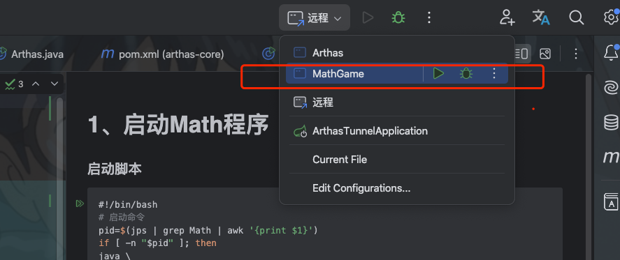
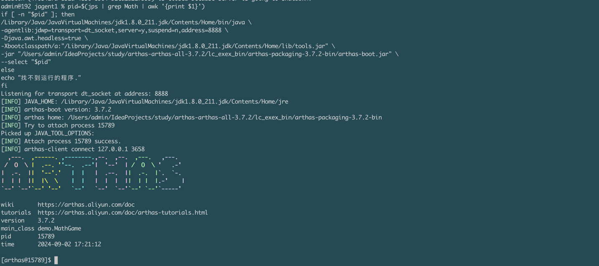
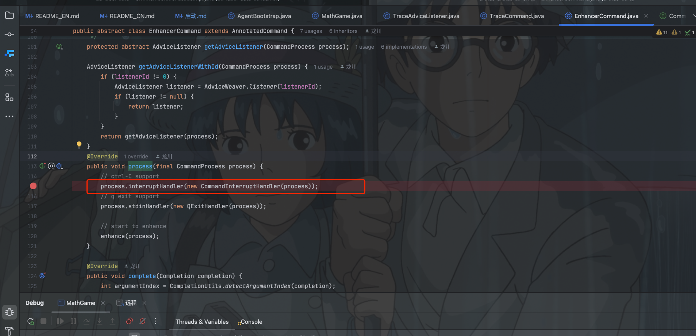
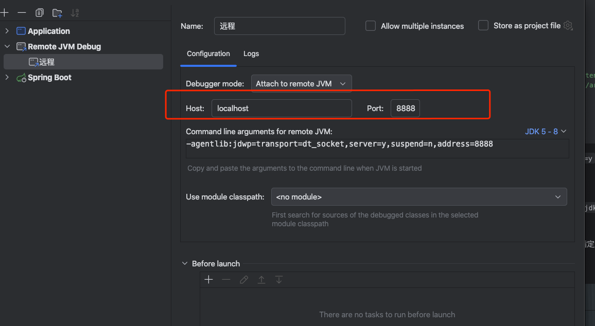
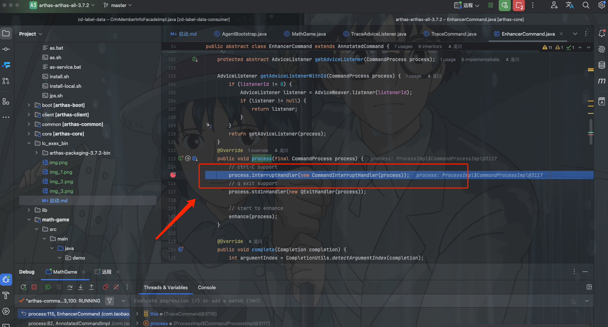

# 1、启动Math程序


# 2、启动Arthas
```bash
#!/bin/bash
# 启动命令  
pid=$(jps | grep Math | awk '{print $1}')
if [ -n "$pid" ]; then
/Library/Java/JavaVirtualMachines/jdk1.8.0_211.jdk/Contents/Home/bin/java \
-agentlib:jdwp=transport=dt_socket,server=y,suspend=n,address=8888 \
-Djava.awt.headless=true \
-Xbootclasspath/a:"/Library/Java/JavaVirtualMachines/jdk1.8.0_211.jdk/Contents/Home/lib/tools.jar" \
-jar "/Users/admin/IdeaProjects/study/arthas-arthas-all-3.7.2/lc_exex_bin/arthas-packaging-3.7.2-bin/arthas-boot.jar" \
--select "$pid"
else
echo "找不到运行的程序."
fi
```

- `-agentlib:jdwp=transport=dt_socket,address=8888,server=y,suspend=y`：启动调试模式，端口号为8888，等待调试器连接。
- `-Djava.awt.headless=true`：启动无图形界面的参数。
- `-Xbootclasspath/a:"/Library/Java/JavaVirtualMachines/jdk1.8.0_211.jdk/Contents/Home/lib/tools.jar"`：指定tools.jar路径，用于支持attach命令。
- `-jar "/Users/admin/IdeaProjects/study/arthas-arthas-all-3.7.2/lc_exex_bin/arthas-packaging-3.7.2-bin/arthas-boot.jar"`：指定启动脚本路径。
- `--select 16672`：指定进程号，启动指定进程的Arthas。


# 3、断点打在com.taobao.arthas.core.command.monitor200.EnhancerCommand.process上面


# 4、启动远程配置


# 5、执行命令



# 6、需要注意点
（1）idea启动的要和arthas启动的jvm是同一个
（2）boot.jar版本和源码版本也要对应，我的是3.7.2，源码版本是3.7.2


